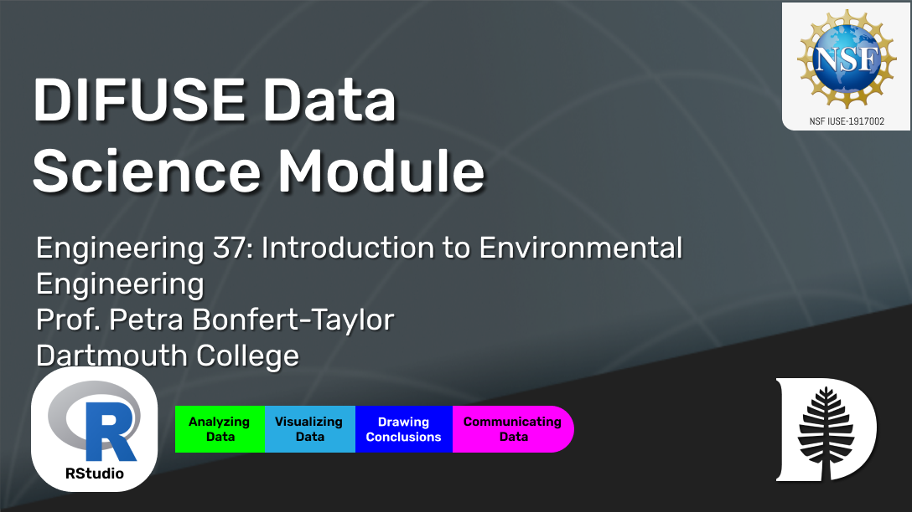

# Environmental Engineering: Air Quality DIFUSE Module

## Contributors: Andy J. Bean ('23), Monika Roznere (GR), Scott D. Pauls (DIFUSE PI, Professor of Mathematics), Petra Bonfert-Taylor (DIFUSE PI, Professor of Engineering), Taylor Hickey ('23, Project Manager)

This module was developed through the DIFUSE project at Dartmouth College and funded by the National Science Foundation award IUSE-1917002.

| | <a rel="license" href="http://creativecommons.org/licenses/by-sa/4.0/"> </a>This work is licensed under a <a rel="license" href="http://creativecommons.org/licenses/by-sa/4.0/">Creative Commons Attribution-ShareAlike 4.0 International License</a>. |
|---------|----------|

# Module Overview
## Module Objective 
The primary objective for this module is to learn and then apply air quality dispersion modeling using an R-based programming module, with the help of the package ‘openair’ and open-sourced air quality datasets of cities in Germany.

## Student Learning Objectives
1. Understand the basics of dispersion modeling
2. Obtain and clean data sets
3. Analyze those data sets
4. Communicate results to peers and target audience members.

## Module Description
Students learn and then apply air quality dispersion modeling using an R-based programming module, with the help of the package ‘openair’ and open-sourced air quality datasets of cities in Germany.

### Data
The module uses measures of air quality in terms of concentrations of different pollutants and other particulate matter using the openair package in R.

### Platform
The module uses R.

## Schedule and Links

Use this page to get an idea of the timeline of the module, what components are involved, and what documents are related to each component. This is the schedule intended for module deployment by the DIFUSE team, though instructors are welcome to modify the timeline to fit their course environment.

| Week  |  Day | Assignment Description  | Assignments Assigned  | Approx. Assignment duration | Assignment Files (Linked to Repository Contents) |
|------|------|-----------------|------------------------------|--------------------------------|--------------------------------|
| Wk 1 | 1     | Introduction to R and RStudio | Asgmt 1 |  2 days | [Assignment 1](completed_module/components/assignment%201) |
|  | 2      | Group Building and Selecting your Germany Site | Asgmt 2 and Asgmt 6 | Asgmt 2 : 1 day and Asgmt 6: Till Week 3 |[Assignment 2 ](completed_module/components/assignment%202), [Assignment 6 ](completed_module/components/assignment%206) |
|  | 3    | Introduction to R Package Openair | Asgmt 3 | 4 days |[Assignment 3](completed_module/components/assignment%203) |
|  | 4      | Open Class | | | |
| Wk 2 | 1    | Tutorial on Advanced Openair | Asgmt 4 and Asgmt 5 | Asgmt 4 : 5 days and Asgmt 5: 2 days |[Assignment 4 ](completed_module/components/assignment%204), [Assignment 5 ](completed-module/components/assignment%205) |
|  | 2    | Group Work |  |  |[Group Work](completed_module/components/Slides%20for%20Group%20Work%20Days%201-4.pptx) |
|  | 3    | Group Work |  |  |[Group Work](completed_module/components/Slides%20for%20Group%20Work%20Days%201-4.pptx) |
|  | 4    | Preliminary Presentations | Asgmt 4 Submission |  |[Assignment 4 ](completed_module/components/assignment%204) |
| Wk 3 | 1    | Group Work | |  |[Group Work](completed_module/components/Slides%20for%20Group%20Work%20Days%201-4.pptx) |
|  | 2    | Group Work | |  |[Group Work](completed_module/components/Slides%20for%20Group%20Work%20Days%201-4.pptx) |
|  | 3    | Final Presentation Part 1 | Asgmt 6 Submission | |[Assignment 6 ](completed_module/components/assignment%206) |
|  | 4    | Final Presentation Part 2 | Asgmt 6 Submission |  |[Assignment 6 ](completed_module/components/assignment%206) |

## Course Information

This module was developed for an engineering course, <a href="http://dartmouth.smartcatalogiq.com/current/orc/Departments-Programs-Undergraduate/Engineering-Sciences/ENGS-Engineering-Sciences-Undergraduate/ENGS-37">Introduction to Environmental Engineering</a>, that is part of a study-abroad program in Germany.  Prerequisites for the course include single variable calculus and one term of general chemistry.
---

| | <a rel="license" href="http://creativecommons.org/licenses/by-sa/4.0/"> </a>This work is licensed under a <a rel="license" href="http://creativecommons.org/licenses/by-sa/4.0/">Creative Commons Attribution-ShareAlike 4.0 International License</a>. |
|---------|----------|

For instructors and interested parties, the history of this repository (with detailed commits), can be found [here](https://github.com/difuse-dartmouth/engineering-visualize-air-quality/commits/main/).

